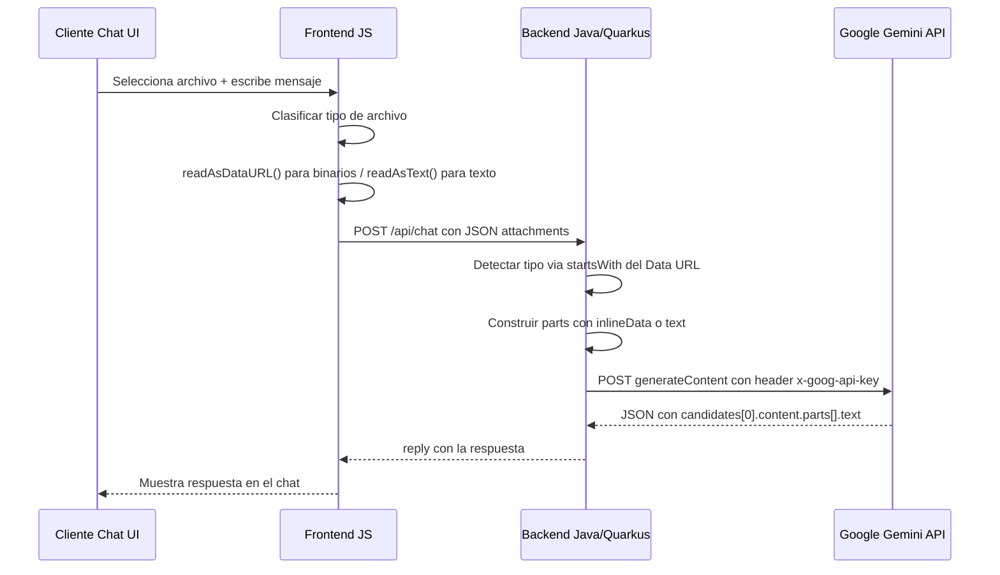

# Informe Técnico: Implementación Multimodal en Agentes IA

**Guía completa para implementar subida y procesamiento de archivos (imágenes, audio, PDFs y texto) en cualquier agente basado en la API de Google Gemini.**

---

## 1. Flujo Completo de Información



---

## 2. Flujo Detallado por Tipo de Archivo

### 2.1 IMAGEN (JPEG, PNG, WebP, GIF, BMP, TIFF)

#### Paso 1 — Frontend: convertir a Data URL
```javascript
const reader = new FileReader();
reader.onload = () => {
    // reader.result = "data:image/jpeg;base64,/9j/4AAQSkZJRg..."
    enviar({ fileName: file.name, fileContent: reader.result });
};
reader.readAsDataURL(file); // Siempre readAsDataURL para binarios
```

#### Paso 2 — JSON enviado al backend
```json
{
  "message": "Que palabra aparece en la imagen?",
  "attachments": [{
    "fileName": "foto.jpg",
    "fileContent": "data:image/jpeg;base64,/9j/4AAQSkZJRg..."
  }]
}
```

#### Paso 3 — Backend: extraer MIME y Base64
```java
if (content.startsWith("data:image/")) {
    // content = "data:image/jpeg;base64,/9j/4AAQ..."
    //                 ^^^^^^^^^^          ^^^^^^^^^^
    //                 MIME type           datos Base64

    // Extraer MIME: desde posicion 5 ("data:" tiene 5 chars) hasta el ";"
    String mimeType = content.substring(content.indexOf("data:") + 5, content.indexOf(";"));
    // mimeType = "image/jpeg"

    // Extraer Base64: todo despues de la coma, sin espacios
    String base64Data = content.substring(content.indexOf(",") + 1).replaceAll("\\s", "");
    // base64Data = "/9j/4AAQSkZJRg..."

    // Construir bloque inlineData
    Map<String, Object> inlineData = new LinkedHashMap<>();
    inlineData.put("mimeType", mimeType);
    inlineData.put("data", base64Data);
    userParts.add(Map.of("inlineData", inlineData));
}
```

#### Paso 4 — JSON que se envia a Gemini
```json
{
  "systemInstruction": {
    "parts": [{ "text": "Eres un asistente con vision nativa..." }]
  },
  "contents": [{
    "role": "user",
    "parts": [
      {
        "inlineData": {
          "mimeType": "image/jpeg",
          "data": "/9j/4AAQSkZJRg..."
        }
      },
      { "text": "Que palabra aparece en la imagen?" }
    ]
  }],
  "generationConfig": { "maxOutputTokens": 8192 }
}
```

El bloque `inlineData` es la clave. Envia los bytes reales al modelo. El campo `mimeType` le dice a Gemini como interpretar esos bytes.

#### Paso 5 — Envio HTTP a Gemini
```java
String url = "https://generativelanguage.googleapis.com/v1beta/models/"
           + modelId + ":generateContent";

HttpRequest request = HttpRequest.newBuilder()
    .uri(URI.create(url))
    .header("Content-Type", "application/json")
    .header("x-goog-api-key", apiKey)  // API key por header, NO en URL
    .POST(HttpRequest.BodyPublishers.ofString(jsonBody))
    .build();
```

La autenticacion se hace mediante el header `x-goog-api-key`. Esto evita que la clave quede registrada en logs de servidor, proxies o trazas de red. Google tambien soporta `?key=` en la URL pero el header es mas seguro.

#### Paso 6 — Parsear respuesta con null-safety
```java
// Comprobar bloqueo por seguridad
List<Map<String, Object>> candidates = (List) responseBody.get("candidates");
if (candidates == null || candidates.isEmpty()) {
    // Gemini bloqueo la respuesta (contenido inapropiado, etc.)
    Map<String, Object> feedback = (Map) responseBody.get("promptFeedback");
    String reason = feedback != null ? String.valueOf(feedback.get("blockReason")) : "desconocida";
    return Map.of("error", "Bloqueado por seguridad. Razon: " + reason);
}

Map<String, Object> candidateContent = (Map) candidates.get(0).get("content");
if (candidateContent == null) {
    // finishReason puede ser SAFETY, RECITATION, etc.
    return Map.of("error", "Sin contenido. finishReason: " + candidates.get(0).get("finishReason"));
}

// Buscar la PRIMERA part con texto (no asumir que es la ultima)
List<Map<String, Object>> parts = (List) candidateContent.get("parts");
for (Map<String, Object> part : parts) {
    String text = (String) part.get("text");
    if (text != null && !text.isBlank()) {
        return Map.of("reply", text);
    }
}
```

---

### 2.2 AUDIO (MP3, WAV, OGG, FLAC, AAC, WebM, M4A)

El flujo es identico al de imagenes. La unica diferencia es el prefijo del Data URL.

#### Frontend
```javascript
reader.readAsDataURL(audioFile);
// Resultado: "data:audio/mpeg;base64,SUQzBAAAAAAAI1RT..."
```

#### Backend
```java
else if (content.startsWith("data:audio/")) {
    // Exactamente igual que imagen: extraer MIME + Base64 → inlineData
    userParts.add(buildInlineData(content));
}
```

#### JSON para Gemini
```json
{ "inlineData": { "mimeType": "audio/mpeg", "data": "SUQzBAAA..." } }
```

---

### 2.3 PDF / PRESENTACIONES

Mismo patron que imagen y audio. Gemini lee el PDF de forma nativa: extrae texto y analiza graficos.

#### Frontend
```javascript
reader.readAsDataURL(pdfFile);
// Resultado: "data:application/pdf;base64,JVBERi0xLjQK..."
```

#### Backend
```java
else if (content.startsWith("data:application/pdf")) {
    userParts.add(buildInlineData(content));
}
```

#### JSON para Gemini
```json
{ "inlineData": { "mimeType": "application/pdf", "data": "JVBERi0x..." } }
```

---

### 2.4 TEXTO / CODIGO

Los archivos de texto NO usan `inlineData`. Se envian como `text` plano.

**Importante:** El frontend puede enviar texto de dos formas distintas:
- `readAsText()` → llega como contenido plano (sin prefijo `data:`)
- `readAsDataURL()` → llega como `data:text/plain;base64,eyJkZWJ1Zy...`

El backend debe manejar **ambos casos**:

```java
else if (content.startsWith("data:text/") && content.contains("base64,")) {
    // Caso 1: texto enviado como Data URL → decodificar Base64
    String base64Data = content.substring(content.indexOf(",") + 1);
    String decoded = new String(
        Base64.getDecoder().decode(base64Data),
        StandardCharsets.UTF_8
    );
    userParts.add(Map.of("text", "--- ARCHIVO: " + name + " ---\n" + decoded + "\n\n"));
}
else if (!content.startsWith("data:")) {
    // Caso 2: texto enviado como contenido plano (readAsText)
    userParts.add(Map.of("text", "--- ARCHIVO: " + name + " ---\n" + content + "\n\n"));
}
```

#### JSON para Gemini
```json
{ "text": "--- ARCHIVO: config.json ---\n{ \"debug\": true }\n\n" }
```

Los delimitadores `--- ARCHIVO: nombre ---` evitan que Gemini confunda el contenido del archivo con la pregunta del usuario.

---

## 3. Tabla de Tipos Soportados

| Tipo | Formatos | MIME types | Campo JSON | Limite inline | Estado |
|:---|:---|:---|:---|:---|:---|
| Imagen | JPEG, PNG, WebP, GIF, BMP, TIFF | `image/*` | `inlineData` | ~15 MB por archivo (20 MB total request) | Operativo |
| Audio | MP3, WAV, OGG, FLAC, AAC, M4A | `audio/*` | `inlineData` | ~15 MB por archivo (20 MB total request) | Operativo |
| PDF | PDF | `application/pdf` | `inlineData` | ~15 MB / ~1000 paginas | Operativo |
| Texto | TXT, JS, PY, JSON, XML, CSV, HTML | `text/*` | `text` | ~1M tokens de contexto | Operativo |
| Video | MP4, MOV, WebM | `video/*` | `fileData` | 2 GB (requiere Files API) | Requiere Files API |

> **Nota sobre el limite de 20 MB:** Es el limite del request HTTP completo (todos los adjuntos sumados). La codificacion Base64 infla el tamano un ~33%, por lo que un archivo de ~15 MB en disco genera ~20 MB de Base64.

---

## 4. Codigo Completo Funcional

```java
package org.acme.runtime;

import jakarta.inject.Inject;
import jakarta.ws.rs.*;
import jakarta.ws.rs.core.MediaType;
import com.fasterxml.jackson.databind.ObjectMapper;
import org.eclipse.microprofile.config.inject.ConfigProperty;
import java.net.URI;
import java.net.http.HttpClient;
import java.net.http.HttpRequest;
import java.net.http.HttpResponse;
import java.util.*;

@Path("/api/chat")
@Consumes(MediaType.APPLICATION_JSON)
@Produces(MediaType.APPLICATION_JSON)
public class ChatResource {

    @ConfigProperty(name = "quarkus.langchain4j.ai.gemini.api-key")
    String apiKey;

    @ConfigProperty(name = "quarkus.langchain4j.ai.gemini.chat-model.model-id",
                    defaultValue = "gemini-2.5-flash")
    String modelId;

    private static final HttpClient httpClient = HttpClient.newHttpClient();

    @Inject
    ObjectMapper objectMapper;

    @POST
    @SuppressWarnings("unchecked")
    public Map<String, Object> chat(Map<String, Object> payload) {
        String message = payload == null || payload.get("message") == null
                ? "" : String.valueOf(payload.get("message"));

        List<Map<String, String>> attachments = payload == null ? null
                : (List<Map<String, String>>) payload.get("attachments");

        try {
            // FASE 1: CLASIFICAR Y TRANSFORMAR ADJUNTOS
            List<Map<String, Object>> userParts = new ArrayList<>();

            if (attachments != null) {
                for (Map<String, String> att : attachments) {
                    String content = att.getOrDefault("fileContent", "").trim();
                    String name = att.getOrDefault("fileName", "adjunto");

                    if (content.startsWith("data:image/")) {
                        userParts.add(buildInlineData(content));
                    }
                    else if (content.startsWith("data:audio/")) {
                        userParts.add(buildInlineData(content));
                    }
                    else if (content.startsWith("data:application/pdf")) {
                        userParts.add(buildInlineData(content));
                    }
                    else if (content.startsWith("data:text/") && content.contains("base64,")) {
                        String base64Data = content.substring(content.indexOf(",") + 1);
                        String decoded = new String(
                            Base64.getDecoder().decode(base64Data),
                            java.nio.charset.StandardCharsets.UTF_8);
                        userParts.add(Map.of("text",
                            "--- ARCHIVO: " + name + " ---\n" + decoded + "\n\n"));
                    }
                    else if (!content.startsWith("data:")) {
                        userParts.add(Map.of("text",
                            "--- ARCHIVO: " + name + " ---\n" + content + "\n\n"));
                    }
                }
            }

            if (!message.isBlank()) {
                userParts.add(Map.of("text", message));
            }

            // FASE 2: CONSTRUIR JSON PARA GEMINI
            Map<String, Object> requestBody = new LinkedHashMap<>();

            requestBody.put("systemInstruction", Map.of(
                "parts", List.of(Map.of("text",
                    "Eres un asistente con vision y oido integrados. " +
                    "Responde en espanol. Analiza adjuntos con detalle."))));

            Map<String, Object> userContent = new LinkedHashMap<>();
            userContent.put("role", "user");
            userContent.put("parts", userParts);
            requestBody.put("contents", List.of(userContent));
            requestBody.put("generationConfig", Map.of("maxOutputTokens", 8192));

            // FASE 3: ENVIAR HTTP CON API KEY EN HEADER
            String jsonBody = objectMapper.writeValueAsString(requestBody);
            String url = "https://generativelanguage.googleapis.com/v1beta/models/"
                       + modelId + ":generateContent";

            HttpRequest request = HttpRequest.newBuilder()
                .uri(URI.create(url))
                .header("Content-Type", "application/json")
                .header("x-goog-api-key", apiKey)
                .POST(HttpRequest.BodyPublishers.ofString(jsonBody))
                .build();

            HttpResponse<String> response = httpClient.send(
                request, HttpResponse.BodyHandlers.ofString());

            // FASE 4: PARSEAR CON NULL-SAFETY
            if (response.statusCode() != 200) {
                return Map.of("error", "HTTP " + response.statusCode()
                    + ": " + response.body());
            }

            Map<String, Object> body = objectMapper.readValue(
                response.body(), Map.class);

            List<Map<String, Object>> candidates =
                (List) body.get("candidates");
            if (candidates == null || candidates.isEmpty()) {
                Map<String, Object> fb = (Map) body.get("promptFeedback");
                String reason = fb != null
                    ? String.valueOf(fb.get("blockReason")) : "desconocida";
                return Map.of("error", "Bloqueado: " + reason);
            }

            Map<String, Object> cc = (Map) candidates.get(0).get("content");
            if (cc == null) {
                return Map.of("error", "Sin contenido: "
                    + candidates.get(0).get("finishReason"));
            }

            List<Map<String, Object>> parts = (List) cc.get("parts");
            if (parts != null) {
                for (Map<String, Object> part : parts) {
                    String text = (String) part.get("text");
                    if (text != null && !text.isBlank())
                        return Map.of("reply", text);
                }
            }
            return Map.of("error", "Respuesta vacia de Gemini");

        } catch (Exception e) {
            return Map.of("error", "Error: " + e.getMessage());
        }
    }

    /** Extrae MIME y Base64 de un Data URL → bloque inlineData */
    private Map<String, Object> buildInlineData(String dataUrl) {
        String mimeType = dataUrl.substring(
            dataUrl.indexOf("data:") + 5, dataUrl.indexOf(";"));
        String base64Data = dataUrl.substring(
            dataUrl.indexOf(",") + 1).replaceAll("\\s", "");
        Map<String, Object> inlineData = new LinkedHashMap<>();
        inlineData.put("mimeType", mimeType);
        inlineData.put("data", base64Data);
        return Map.of("inlineData", inlineData);
    }
}
```

---

## 5. La API Key: Como se Usa

### Obtener la API Key
1. Ir a [Google AI Studio](https://aistudio.google.com/apikey)
2. Crear o seleccionar un proyecto
3. Generar una API Key (empieza por `AIzaSy...`)

### Como viaja la API Key
Se envia como **header HTTP** (metodo seguro):

```
POST https://generativelanguage.googleapis.com/v1beta/models/gemini-2.5-flash:generateContent
Header: x-goog-api-key: AIzaSyB...dw
Header: Content-Type: application/json
```

| Parte | Valor |
|:---|:---|
| Base URL | `https://generativelanguage.googleapis.com/v1beta` |
| Modelo | `/models/gemini-2.5-flash` |
| Accion | `:generateContent` |
| Auth | Header `x-goog-api-key` |

> Google tambien soporta `?key=` en la URL, pero el header es preferible porque la URL queda en logs de servidor y proxies.

### Configuracion en el servidor
```properties
quarkus.langchain4j.ai.gemini.api-key=${GEMINI_API_KEY:}
quarkus.langchain4j.ai.gemini.chat-model.model-id=${GEMINI_MODEL:gemini-2.5-flash}
quarkus.http.limits.max-body-size=2000M
```

---

## 6. Guia de Implementacion en Otro Agente

### Paso 1: Requisitos
- Java 17+ (o cualquier lenguaje con HttpClient)
- API Key de Google Gemini
- Serializador JSON (Jackson, Gson, etc.)

### Paso 2: Logica del Clasificador
```java
if (content.startsWith("data:image/"))             → buildInlineData()
else if (content.startsWith("data:audio/"))         → buildInlineData()
else if (content.startsWith("data:application/pdf"))→ buildInlineData()
else if (content.startsWith("data:text/"))          → decodificar Base64 → text
else if (!content.startsWith("data:"))              → text plano directo
```

Usar `startsWith` en lugar de `contains` para evitar falsos positivos.

### Paso 3: Extraccion universal de MIME y Base64
Para CUALQUIER tipo binario (imagen, audio, PDF), la operacion es siempre la misma:

```java
// Data URL: "data:image/jpeg;base64,/9j/4AAQ..."
//                 ^^^^^^^^^^          ^^^^^^^^^^^
//                 MIME type           datos Base64

String mimeType   = dataUrl.substring(dataUrl.indexOf("data:") + 5, dataUrl.indexOf(";"));
String base64Data = dataUrl.substring(dataUrl.indexOf(",") + 1).replaceAll("\\s", "");
```

### Paso 4: Estructura JSON para Gemini

Binarios → `inlineData`:
```json
{ "inlineData": { "mimeType": "image/jpeg", "data": "/9j/4AAQ..." } }
```

Texto → `text`:
```json
{ "text": "--- ARCHIVO: app.js ---\nconsole.log('hello');\n\n" }
```

### Paso 5: Enviar y parsear
```
POST → generativelanguage.googleapis.com
Header: x-goog-api-key
Response → candidates[0].content.parts[].text (buscar primera part con texto)
```

---

## 7. Errores Comunes y Soluciones

| Error | Causa | Solucion |
|:---|:---|:---|
| HTTP 503 "high demand" | Servidores de Google saturados | Reintentar en 10-30 segundos |
| HTTP 429 "quota exceeded" | Cuota agotada | Esperar reset diario o plan de pago |
| HTTP 400 "invalid base64" | Saltos de linea en Base64 | `.replaceAll("\\s", "")` |
| candidates es null | Gemini bloqueo por seguridad | Leer `promptFeedback.blockReason` |
| content es null | finishReason SAFETY o RECITATION | Leer `finishReason` del candidate |
| Archivos texto descartados | Frontend usa readAsDataURL para texto | Backend debe detectar `data:text/` y decodificar Base64 |
| Gemini "alucina" contenido | Proxy toString() de LangChain4j | Usar HTTP directo, no proxy |

---

## 8. Detalle Tecnico por Tipo

| Propiedad | Imagen | Audio | PDF | Texto |
|:---|:---|:---|:---|:---|
| Prefijo | `data:image/*` | `data:audio/*` | `data:application/pdf` | `data:text/*` o sin prefijo |
| Campo Gemini | `inlineData` | `inlineData` | `inlineData` | `text` |
| Codificacion | Base64 | Base64 | Base64 | UTF-8 plano |
| Frontend | readAsDataURL() | readAsDataURL() | readAsDataURL() | readAsText() o readAsDataURL() |
| Limite por request | ~20 MB total (todos los adjuntos) | ~20 MB total | ~20 MB / ~1000 pags | ~1M tokens |
| Modelo minimo | gemini-2.0-flash | gemini-2.0-flash | gemini-2.0-flash | Cualquier Gemini |
