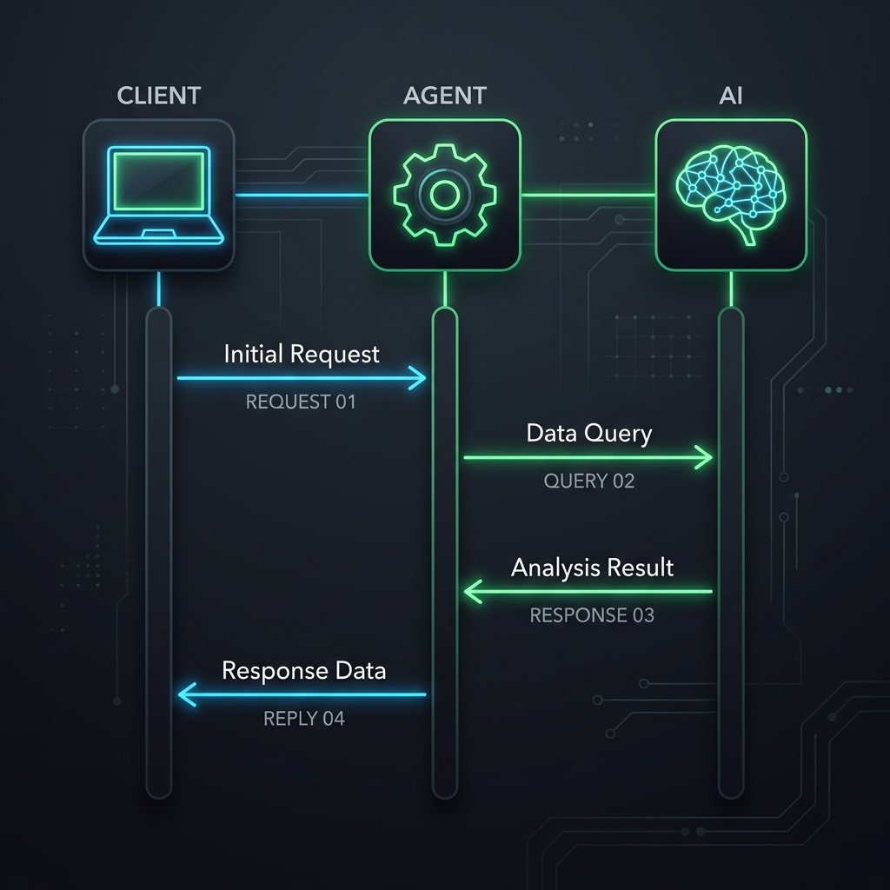
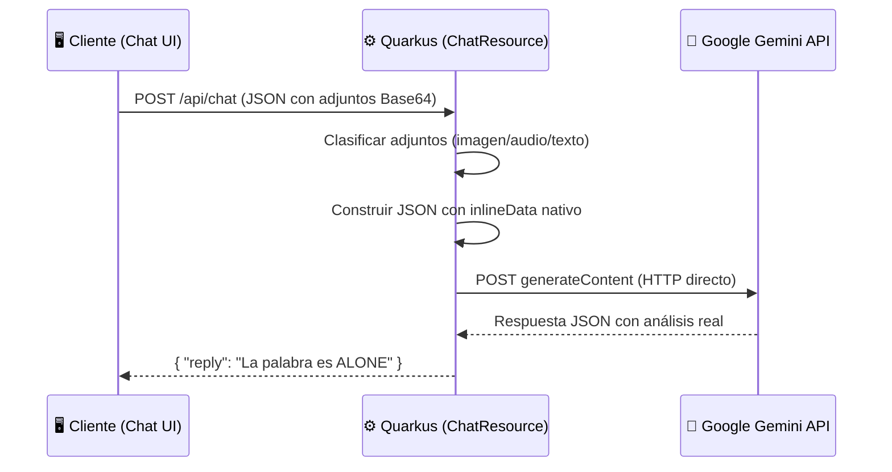
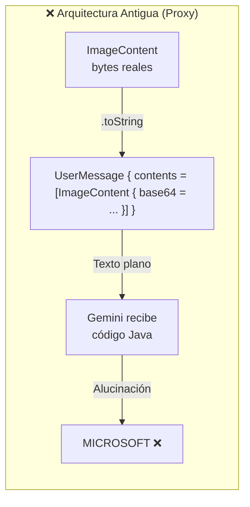
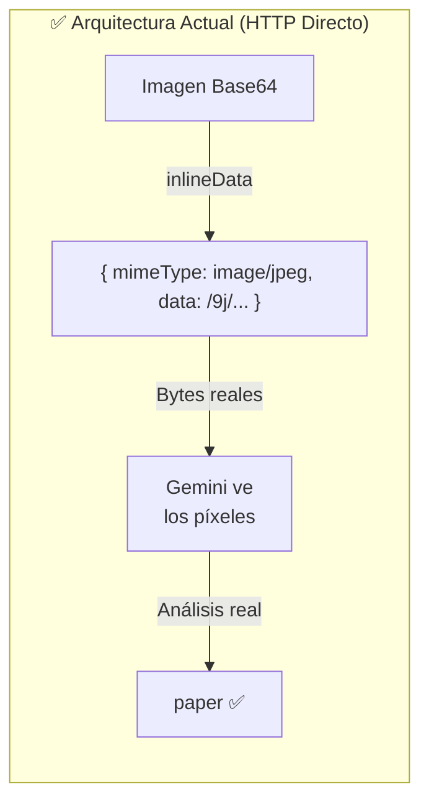

# Informe Técnico de Subida de Archivos e Imágenes

Este documento detalla la arquitectura de **lectura multiformato** que permite al agente procesar archivos de texto, código, imágenes y audio de manera fluida, utilizando una **llamada HTTP directa** a la API de Google Gemini.

> [!IMPORTANT]
> Esta arquitectura fue rediseñada para superar una limitación crítica del proxy `@RegisterAiService` de Quarkus LangChain4j, que convertía los datos binarios multimodales (imágenes, audio) a texto plano mediante `.toString()`, impidiendo la visión nativa del modelo.

---

## 1. 📂 Flujo Completo de Información

### Esquema Conceptual


> [!NOTE]
> El sistema utiliza una arquitectura de **llamada HTTP directa** a la API de Gemini. Cada archivo adjunto se transforma en un bloque `inlineData` con su MIME type y datos Base64, garantizando que los bytes lleguen intactos al modelo.

### Diagrama de Secuencia (Arquitectura Real)



---

## 2. 📨 Estructura de Mensajes (JSON)

### De Cliente a Agente
El cliente envía un objeto JSON donde los archivos vienen codificados como **Data URLs** (Base64).

**Ejemplo con imagen:**
```json
{
  "conversationId": "sesion-001",
  "message": "¿Qué palabra aparece en la imagen?",
  "attachments": [
    {
      "fileName": "foto.jpg",
      "fileContent": "data:image/jpeg;base64,/9j/4AAQSkZJRg..."
    }
  ]
}
```

**Ejemplo con audio:**
```json
{
  "conversationId": "sesion-001",
  "message": "¿Qué se dice en este audio?",
  "attachments": [
    {
      "fileName": "grabacion.mp3",
      "fileContent": "data:audio/mpeg;base64,SUQzBAAAAAAAI1RT..."
    }
  ]
}
```

**Ejemplo mixto (imagen + audio + texto):**
```json
{
  "conversationId": "sesion-001",
  "message": "Analiza todos estos archivos",
  "attachments": [
    { "fileName": "captura.png", "fileContent": "data:image/png;base64,iVBOR..." },
    { "fileName": "nota_voz.mp3", "fileContent": "data:audio/mpeg;base64,SUQz..." },
    { "fileName": "config.json", "fileContent": "{ \"debug\": true }" }
  ]
}
```


### Del Agente a la API de Gemini
El servidor transforma cada adjunto en el formato nativo de Gemini (`inlineData`):

```json
{
  "systemInstruction": {
    "parts": [{ "text": "Eres Claudio, un asistente con visión..." }]
  },
  "contents": [{
    "role": "user",
    "parts": [
      {
        "inlineData": {
          "mimeType": "image/jpeg",
          "data": "/9j/4AAQSkZJRg..."
        }
      },
      { "text": "¿Qué palabra aparece en la imagen?" }
    ]
  }],
  "generationConfig": { "maxOutputTokens": 8192 }
}
```

> [!TIP]
> La clave es el bloque `inlineData`. A diferencia del proxy de LangChain4j (que convertía la imagen a texto), esta estructura envía los **bytes reales** al modelo, habilitando la visión nativa.

---

## 3. 🗂️ Tipos de Archivos Soportados

| Tipo | MIME Types | Tratamiento en el Servidor | Capacidad del Modelo |
|:---|:---|:---|:---|
| **Imágenes** | `image/jpeg`, `image/png`, `image/webp`, `image/gif` | → `inlineData` (Base64 binario) | 👁️ Visión nativa |
| **Audio** | `audio/mpeg`, `audio/wav`, `audio/ogg`, `audio/webm` | → `inlineData` (Base64 binario) | 👂 Escucha nativa |
| **Texto/Código** | `text/*`, `application/json`, etc. | → `text` (contenido plano) | 📝 Análisis textual |

### Clasificación Automática
El servidor detecta el tipo de archivo analizando el prefijo del Data URL:

```
data:image/jpeg;base64,... → Imagen  → inlineData
data:audio/mpeg;base64,... → Audio   → inlineData
data:text/plain;base64,... → Texto   → text (decodificado)
```

---

## 4. ⚙️ Implementación del Servidor (Java / Quarkus)

### `ChatResource.java` — Motor de Comunicación Directa

El servidor actúa como un **puente HTTP** entre el cliente y la API de Gemini, sin intermediarios:

```java
@Path("/api/chat")
public class ChatResource {

    @ConfigProperty(name = "quarkus.langchain4j.ai.gemini.api-key")
    String apiKey;

    @ConfigProperty(name = "quarkus.langchain4j.ai.gemini.chat-model.model-id",
                    defaultValue = "gemini-2.5-flash")
    String modelId;

    private static final HttpClient httpClient = HttpClient.newHttpClient();

    @POST
    public Map<String, Object> chat(Map<String, Object> payload) {
        List<Map<String, Object>> userParts = new ArrayList<>();

        for (Map<String, String> att : attachments) {
            String content = att.get("fileContent");

            if (content.contains("data:image/")) {
                // IMAGEN → inlineData (visión nativa)
                String mimeType = /* extraer MIME */;
                String base64Data = /* extraer datos */;
                userParts.add(Map.of("inlineData",
                    Map.of("mimeType", mimeType, "data", base64Data)));
            }
            else if (content.contains("data:audio/")) {
                // AUDIO → inlineData (escucha nativa)
                userParts.add(Map.of("inlineData",
                    Map.of("mimeType", mimeType, "data", base64Data)));
            }
            else {
                // TEXTO/CÓDIGO → text
                userParts.add(Map.of("text",
                    "--- ARCHIVO: " + name + " ---\n" + content));
            }
        }

        // Llamada HTTP directa a Gemini
        String url = "https://generativelanguage.googleapis.com/v1beta/models/"
                   + modelId + ":generateContent?key=" + apiKey;
        // ... enviar y parsear respuesta ...
    }
}
```

> [!CAUTION]
> **NO** se debe usar el proxy `@RegisterAiService` de Quarkus LangChain4j para contenido multimodal. El proxy convierte los objetos `UserMessage` a `.toString()`, destruyendo los datos binarios. La llamada HTTP directa es la única forma fiable de enviar imágenes y audio al modelo.

---

## 5. 🏗️ Arquitectura: ¿Por qué HTTP Directo?

### El Problema del Proxy de Quarkus





### Comparativa

| Aspecto | Proxy `@RegisterAiService` | HTTP Directo |
|:---|:---|:---|
| Imágenes | ❌ Convertidas a `.toString()` | ✅ Enviadas como `inlineData` |
| Audio | ❌ Convertido a `.toString()` | ✅ Enviado como `inlineData` |
| Dependencias CDI | ❌ Conflictos de ClassLoader | ✅ Sin dependencias extra |
| Control del JSON | ❌ Opaco (gestionado por proxy) | ✅ Control total |
| Estabilidad | ❌ Errores frecuentes de arranque | ✅ Arranque fiable |

---

## 6. 🔧 Configuración (`application.properties`)

```properties
# Puerto del servidor
quarkus.http.port=${PORT:8090}

# API Key de Gemini (se configura desde la interfaz)
quarkus.langchain4j.ai.gemini.api-key=${GEMINI_API_KEY:}

# Modelo a utilizar (gemini-2.5-flash soporta visión y audio)
quarkus.langchain4j.ai.gemini.chat-model.model-id=${GEMINI_MODEL:gemini-2.5-flash}

# Logs de depuración
quarkus.langchain4j.log-requests=true
quarkus.langchain4j.log-responses=true

# Tamaño máximo de archivos adjuntos
quarkus.http.limits.max-body-size=2000M
```

---

## 7. 📋 Puntos Clave para la Implementación

| Característica | Beneficio |
|:---|:---|
| **`inlineData`** | Los bytes de la imagen llegan intactos a Gemini, habilitando visión real |
| **Clasificación automática** | El servidor detecta imagen/audio/texto sin intervención del usuario |
| **`systemInstruction`** | La identidad de Claudio se envía como instrucción nativa de Gemini |
| **Control de errores** | Los errores HTTP (503, 429) se devuelven con detalle al cliente |
| **Sin proxy** | Elimina los conflictos de ClassLoader y la corrupción de datos |

---

> [!IMPORTANT]
> Esta arquitectura soporta **cualquier formato** que Gemini pueda procesar: JPEG, PNG, WebP, GIF (imágenes), MP3, WAV, OGG (audio), y texto plano (código, JSON, XML, CSV, logs). El límite es el tamaño máximo de la API de Gemini (~20MB por archivo inline).
